# (PART\*) Student Guide {-}


# Setup

Welcome!  This lab will introduce you to some basic data analysis using the [R programming language](https://www.r-project.org/).  In order to do this, there are a few steps you need to complete so that you can access the material.

## Set up Account


In order to run your analyses, you will use the [AnVIL cloud computing platform](https://anvilproject.org/), so that you do not need to install everything on your own computer.  The AnVIL (Analysis Visualization and Informatics Lab-space) platform is specially designed for analyzing biological data, and is used by scientists doing all sorts of biological research.

:::{.notice}
**AnVIL in a nutshell**

- Behind the scenes, AnVIL relies on Google Cloud Platform to provide computing infrastructure.  Basically, AnVIL lets you "rent" computers from Google (remotely).  Whenever you run an analyses on AnVIL, it actually runs on one of Google's computers, and AnVIL lets you see the results in your browser.
- AnVIL uses [Terra](https://anvil.terra.bio/) to provide many computational tools useful for biological data analysis, such as [RStudio](https://www.rstudio.com/products/rstudio/), [Galaxy](https://usegalaxy.org/), and [Jupyter Notebooks](https://jupyter.org/).  Terra takes care of installing these tools on Google's computers, so that you can just start using them.
:::

### Create Google Account

First, you will need to set up a (free) Google account.

If you do not already have a Google account that you would like to use for accessing AnVIL, [create one now](https://accounts.google.com/SignUp).

- Alternatively, if you would like to create a Google account that is associated with an existing non-Gmail email address, you can follow [these instructions](https://support.terra.bio/hc/en-us/articles/360029186611).

### Log In to Terra

Next, make sure you can log in to Terra -- you will use Terra to perform computations on AnVIL. 

You can access Terra by going to [`anvil.terra.bio`](https://anvil.terra.bio/), or by clicking the link on the [AnVIL home page](https://anvilproject.org/).


Open Terra, and you should be prompted to sign in with your Google account.

### Share Username

Finally, make sure your instructor has your Google account username (e.g. `myname@gmail.com`), so they can give you access to everything you need.

- Make sure there are no typos!
- If you have multiple Google accounts, make sure you give them the username that you will be using to access AnVIL

:::{.warning}
It is *very important* that you share the Google account you will be using to access AnVIL with with your instructor! Otherwise, the instructor cannot add you to Billing Projects or Workspaces, and you will be unable to proceed with your assignments.
:::

## Access Materials


:::{.warning}
This **will not work** until your instructor has given you permission to spend money to "rent" the computers that will power your analyses (by adding you to a "Billing Project").
:::

On AnVIL, you access files and computers through **Workspaces**.  Each Workspace functions almost like a mini code laboratory - it is a place where data can be examined, stored, and analyzed. The first thing we want to do is to copy or “clone” a Workspace to create a space for you to experiment.  This will give you access to

- the files you will need (data, code)
- the computing environment you will use

:::{.notice}
**Tip**
At this point, it might make things easier to open up a new window in your browser and split your screen. That way, you can follow along with this guide on one side and execute the steps on the other.
:::

To clone an AnVIL Workspace:

1. Open Terra - use a web browser to go to [`anvil.terra.bio`](https://anvil.terra.bio/)

1. In the drop-down menu on the left, navigate to "Workspaces". Click the triple bar in the top left corner to access the menu. Click "Workspaces".

    

1. You are automatically directed to the "MY WORKSPACES" tab.  Here you can see any Workspaces that have been shared with you, along with your permission level.  Depending on how your instructor has set things up, you may or may not see any Workspaces in this tab.

    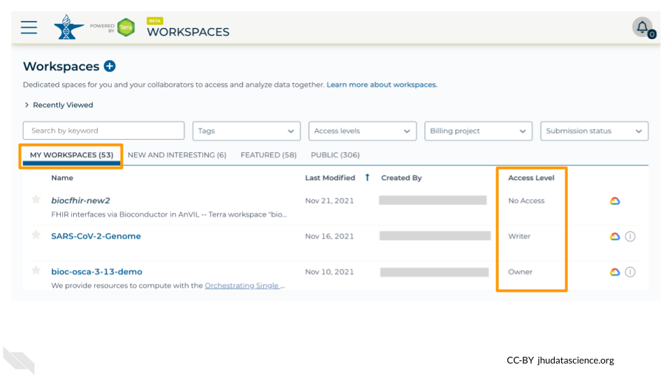
    
1. Locate the Workspace **specified by your instructor**.  (The images below show the SARS-CoV-2-Genome Workspace as an example, but you should look for the Workspace  **specified by your instructor**.)
    a. If it has been shared with you ahead of time, it will appear in "MY WORKSPACES".  

    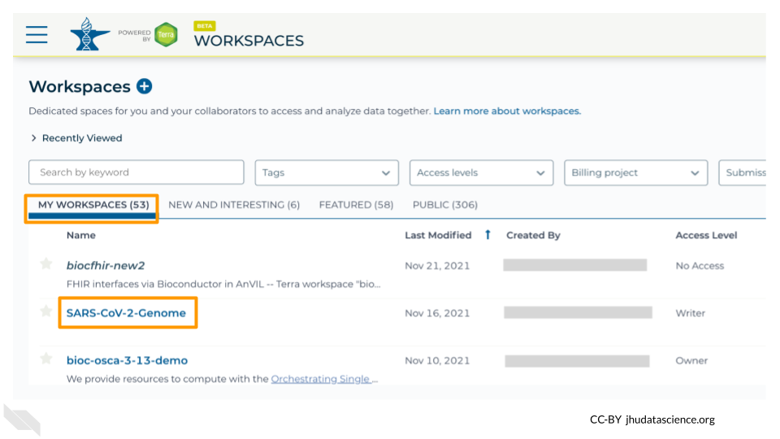
    b. Otherwise, select the "PUBLIC" tab.  In the top search bar, type the Workspace name **specified by your instructor**.

    
    c. You can also go directly to the Workspace by clicking this link: ask your instructor.
    
1. Clone the workspace by clicking the teardrop button ({width=25px}). Select "Clone".  Or, if you have opened the Workspace, you can find the teardrop button on the top right of the Workspace.

    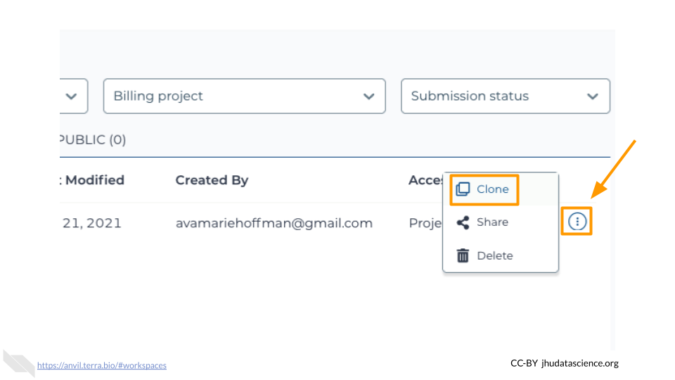
    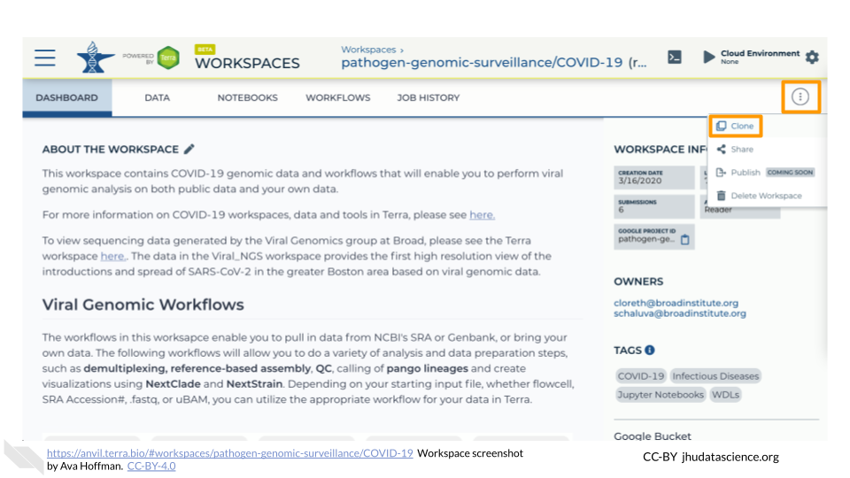

1. You will see a popup box appear, asking you to configure your Workspace
    a. Give your Workspace clone a name by adding an underscore ("_") and your name. For example, \"workspacename_Firstname_Lastname\".
    a. Select the Billing Project provided by your instructor.
    a. Leave the bottom two boxes as-is.
    a. Click “CLONE WORKSPACE”.
    
    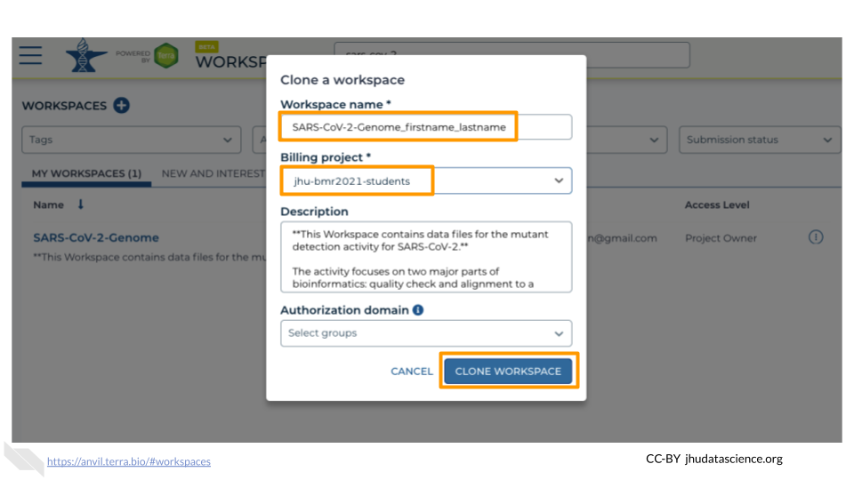

1. The new Workspace should now show up under "MY WORKSPACES".  You now have your own copy of the Workspace to work in.

## Start RStudio


:::{.warning}
AnVIL is very versatile and can scale up to use very powerful cloud computers. It's very important that you select the cloud computing environment described here to avoid runaway costs.
:::


1. Open Terra - use a web browser to go to [`anvil.terra.bio`](https://anvil.terra.bio/)

1. In the drop-down menu on the left, navigate to "Workspaces". Click the triple bar in the top left corner to access the menu. Click "Workspaces".

    

1. Click on the name of your Workspace. You should be routed to a link that looks like: `https://anvil.terra.bio/#workspaces/<billing-project>/<workspace-name>`.

1. Click on the cloud icon on the far right to access your Cloud Environment options.

    

1. In the dialogue box, click the "Settings" button under RStudio

    

1. You will see some details about the default RStudio cloud environment, and a list of costs because it costs a small amount of money to use cloud computing.

    

    


1. Click "CUSTOMIZE" to adjust the settings for your environment.

    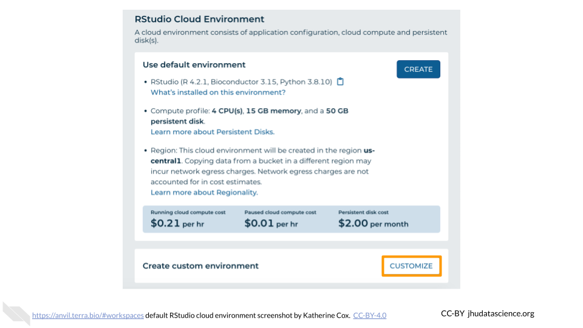

    

    


1. Under "Startup script" you will see textbox.  Copy the following link into the box:

    ` ask your instructor `

    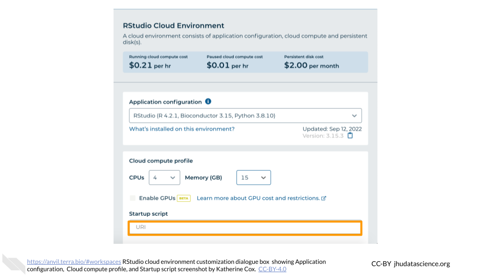


1. Leave everything else as-is. To create your RStudio Cloud Environment, click on the “CREATE” button.

    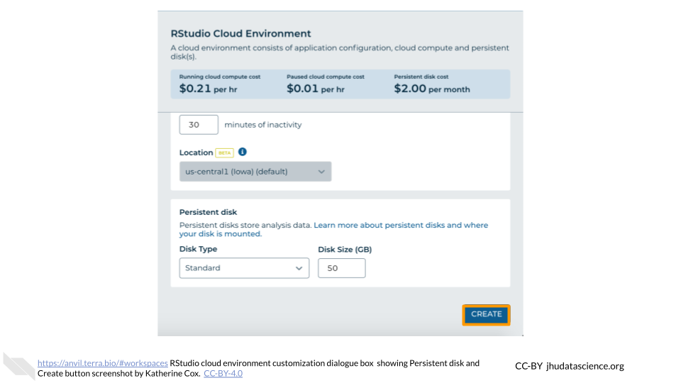

1. The dialogue box will close and you will be returned to your Workspace.  You can see the status of your cloud environment by hovering over the RStudio logo.  It will take a few minutes for Terra to request computers and install software.

    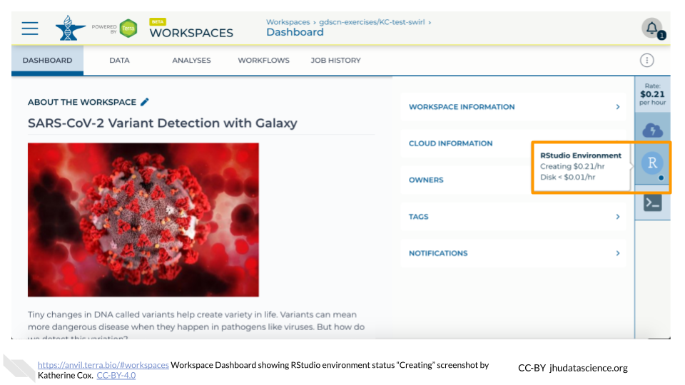

1. When your environment is ready, its status will change to “Running”.  Click on the RStudio logo to open a new dialogue box that will let you launch RStudio.

    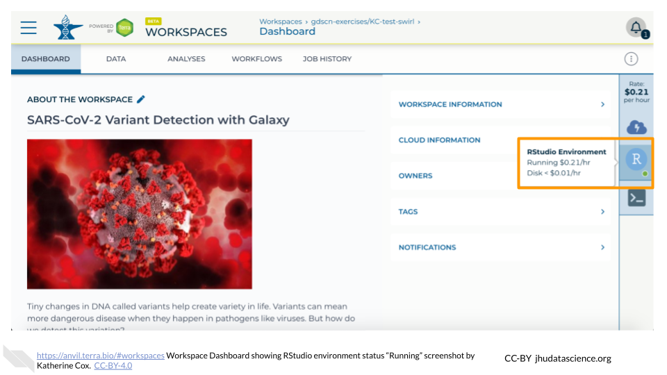
    
1. Click the launch icon to open RStudio.  This is also where you can pause, modify, or delete your environment when needed.

    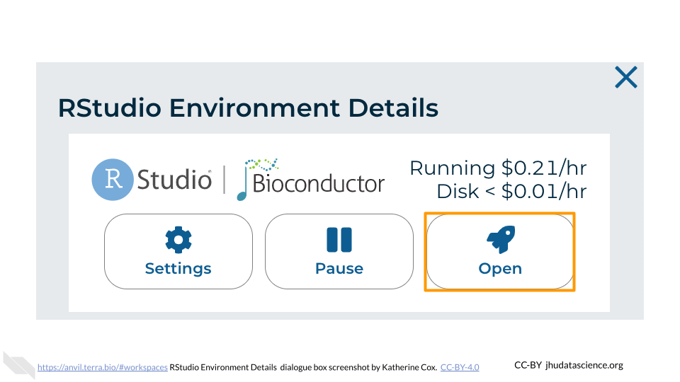

1. You should now see the RStudio interface with information about the version printed to the console.

    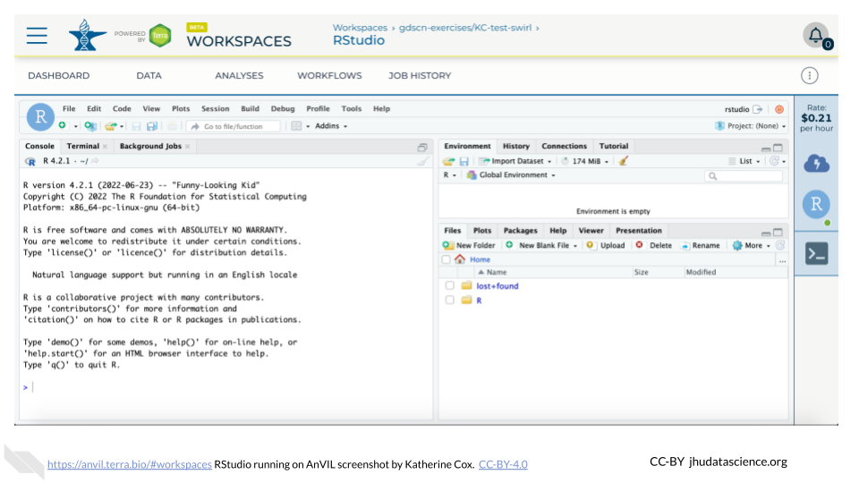


-----

1. Click on the name of a Workspace to open it.  Opening and viewing a Workspace does not cost anything.

    

1. When you open a Workspace, you are directed to the Workspace Dashboard.  This generally has a description of the Workspace contents, as well as some useful details about the Workspace itself.

    

Once you have created a Workspace, you can create an RStudio cloud environment. This will allow you to interface with data and perform genomics-based analyses with add on packages from the Bioconductor community.

# Introduction

# Exercises

## Complete your first `swirl` lesson

*Estimated time: 20 min*

1. Open RStudio.
1. In the R console window, type the following commands to load the `swirl` package:

    ```
    library(swirl)
    swirl()
    ```

1. Install the course “**R Programming: The basics of programming in R**”, by following the instructions provided by `swirl`.
    a. Enter your name.
    a. Press `ENTER`.
    a. Enter `1`, `2`, or `3`.
    a. Install the course “R Programming: The basics of programming in R”.
1. Complete your first lesson.
    a. Select “**R Programming**”.
    a. Select “**Basic Building Blocks**”, by entering `1` ( i.e. the corresponding lesson number ).
    a. Follow the instructions provided by `swirl` to complete your first lesson.
    a. At the end, when `swirl` asks if you would like to receive Coursera credit, select “No”.


## Complete additional `swirl` lessons

*Estimated time: 80 min*

1. Complete additional `swirl` lessons. 
    a. Select “**R Programming**”
    a. Compete each of the following lessons:
        - **4: Vectors**
        - **5: Missing_Values**
        - **6: Subsetting_Vectors**
        - **12: Looking_at_Data**
1. Once you have completed all the lessons listed above, exit `swirl`.
    a. To exit `swirl`, type `bye()` in the R console, press `ESC` on your keyboard, or enter `0` in response to the `swirl` course menu prompt.

# Project: Explore dataframe

Now we will use your new R skills to explore a data.frame!

<br>

## R tips

Don't worry if you can't remember everything!  Data scientists and computer programmers don't memorize everything either.  That's why there's a help function built in to R!

As a reminder, here are a few useful commands for exploring dataframes:
```
dim()
head()
tail()
summary()
str()
```

If you need help remembering how to use a command, use `?`
```
?dim
```

If you start using R frequently, you'll naturally start to remember some of the common commands.  But don't hesitate to look things up, or ask if you get stuck!

## Explore the ??? dataframe


Here are some instructions for exploring `awesomedata`!

# Wrap-up

Cloud computing costs are based on the amount of time you use the computing resources, so it's important to clean up after yourself when you're done, and not just leave the computers running.

There are two ways to "shut down" RStudio on AnVIL:

- **Pause** the environment: This will save a copy of your work, and then release the computers for other people to use them.  **Do this if you plan to continue working in RStudio**.
    - It's similar to turning off your computer or phone - when you start it back up, everything will be where you left it.
    - This still costs a small amount of money, but much less than leaving the computer running.  
- **Delete** the environment: This will delete everything and then release the computers for other people to use them.  **Do this if you are completely finished working in RStudio**, or if your future work will be in a new environment.
    - It's similar to throwing your computer or phone in the trash!
    - **You will not be able to recover your work.**
    - Make sure you have saved anything you need before you delete your environment.  

## Pause RStudio environment


1. The upper right corner reminds you that you are accruing cloud computing costs.

    

1. You should minimize charges when you are not performing an analysis. You can do this by clicking on “Stop cloud environment”. This will release the CPU and memory resources for other people to use. Note that your work will be saved in the environment and continue to accrue a very small cost.  This work will be lost if the cloud environment gets deleted.  If there is anything you would like to save permanently, it's a good idea to copy it from your compute environment to another location, such as the Workspace bucket, GitHub, or your local machine, depending on your needs.

    

## Delete RStudio environment


1. Stopping your cloud environment only pauses your work. When you are ready to delete the cloud environment, click on the gear icon in the upper right corner to “Update cloud environment”.

    

1. Click on “Delete Environment Options”.

    

1. If you are certain that you do not need the data and configuration on your disk, you should select "Delete everything, including persistent disk".  If there is anything you would like to save, open the compute environment and copy the file(s) from your compute environment to another location, such as the Workspace bucket, GitHub, or your local machine, depending on your needs.

    

1. Select "DELETE".

    
