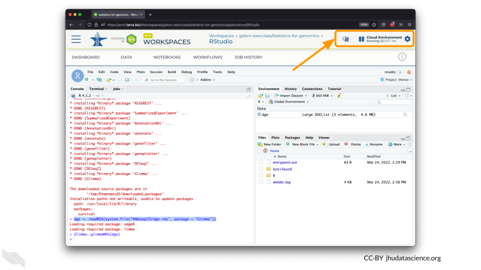
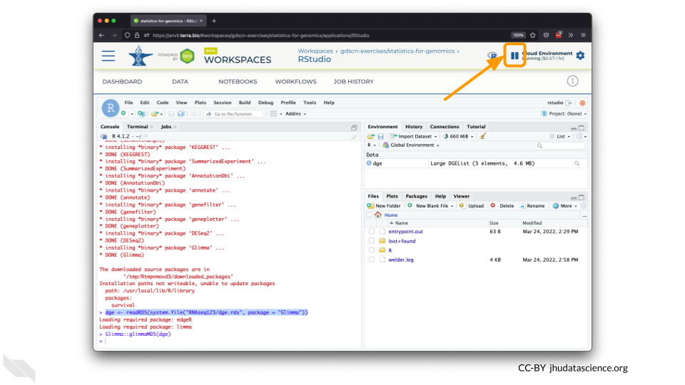
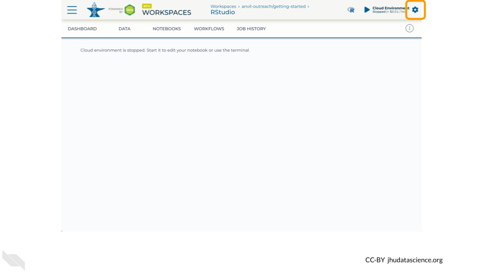
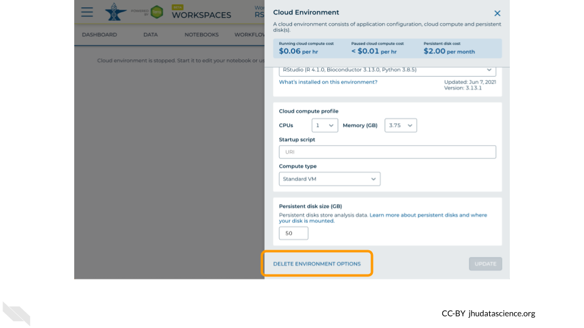
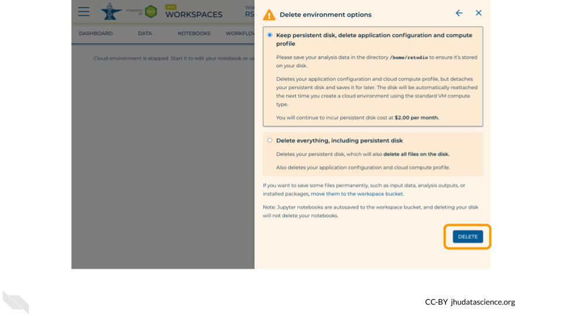

# (PART\*) Student Guide {-}


# Setup

# Introduction

# Exercises

## Complete your first `swirl` lesson

*Estimated time: 20 min*

1. Open RStudio.
1. In the R console window, type the following commands to load the swirl package:

    ```
    library(swirl)
    swirl()
    ```

1. Install the course “**R Programming: The basics of programming in R**”, by following the instructions provided by swirl.
    a. Enter your name.
    a. Press `ENTER`.
    a. Enter `1`, `2`, or `3`.
    a. Install the course “R Programming: The basics of programming in R”.
1. Complete your first lesson.
    a. Select “**R Programming**”.
    a. Select “**Basic Building Blocks**”, by entering `1` ( i.e. the corresponding lesson number ).
    a. Follow the instructions provided by swirl to complete your first lesson.
    a. At the end, when swirl asks if you would like to receive Coursera credit, select “No”.


## Complete additional `swirl` lessons

*Estimated time: 80 min*

1. Complete additional swirl lessons. 
    a. Select “**R Programming**”
    a. Compete each of the following lessons:
        - **4: Vectors**
        - **5: Missing_Values**
        - **6: Subsetting_Vectors**
        - **12: Looking_at_Data**
1. Once you have completed all the lessons listed above, exit swirl.
    a. To exit swirl, type `bye()` in the R console, press `ESC` on your keyboard, or enter `0` in response to the swirl course menu prompt.

# Project: Explore dataframe

Now we will use your new R skills to explore a data.frame!

<br>

## R tips

Don't worry if you can't remember everything!  Data scientists and computer programmers don't memorize everything either.  That's why there's a help function built in to R!

As a reminder, here are a few useful commands for exploring dataframes:
```
dim()
head()
tail()
summary()
str()
```

If you need help remembering how to use a command, use `?`
```
?dim
```

If you start using R frequently, you'll naturally start to remember some of the common commands.  But don't hesitate to look things up, or ask if you get stuck!

## Explore the ??? dataframe


Here are some instructions for exploring `awesomedata`!

# Wrap-up

Cloud computing costs are based on the amount of time you use the computing resources, so it's important to clean up after yourself when you're done, and not just leave the computers running.

There are two ways to "shut down" RStudio on AnVIL:

- **Pause** the environment: This will save a copy of your work, and then release the computers for other people to use them.  **Do this if you plan to continue working in RStudio**.
    - It's similar to turning off your computer or phone - when you start it back up, everything will be where you left it.
    - This still costs a small amount of money, but much less than leaving the computer running.  
- **Delete** the environment: This will delete everything and then release the computers for other people to use them.  **Do this if you are completely finished working in RStudio**, or if your future work will be in a new environment.
    - It's similar to throwing your computer or phone in the trash!
    - **You will not be able to recover your work.**
    - Make sure you have saved anything you need before you delete your environment.  

## Pause RStudio environment


1. The upper right corner reminds you that you are accruing cloud computing costs.

    

1. You should minimize charges when you are not performing an analysis. You can do this by clicking on “Stop cloud environment”. This will release the CPU and memory resources for other people to use. Note that your work will be saved in the environment and continue to accrue a very small cost.  This work will be lost if the cloud environment gets deleted.  If there is anything you would like to save permanently, it's a good idea to copy it from your compute environment to another location, such as the Workspace bucket, GitHub, or your local machine, depending on your needs.

    

## Delete RStudio environment


1. Stopping your cloud environment only pauses your work. When you are ready to delete the cloud environment, click on the gear icon in the upper right corner to “Update cloud environment”.

    

1. Click on “Delete Environment Options”.

    

1. If you are certain that you do not need the data and configuration on your disk, you should select "Delete everything, including persistent disk".  If there is anything you would like to save, open the compute environment and copy the file(s) from your compute environment to another location, such as the Workspace bucket, GitHub, or your local machine, depending on your needs.

    

1. Select "DELETE".

    
