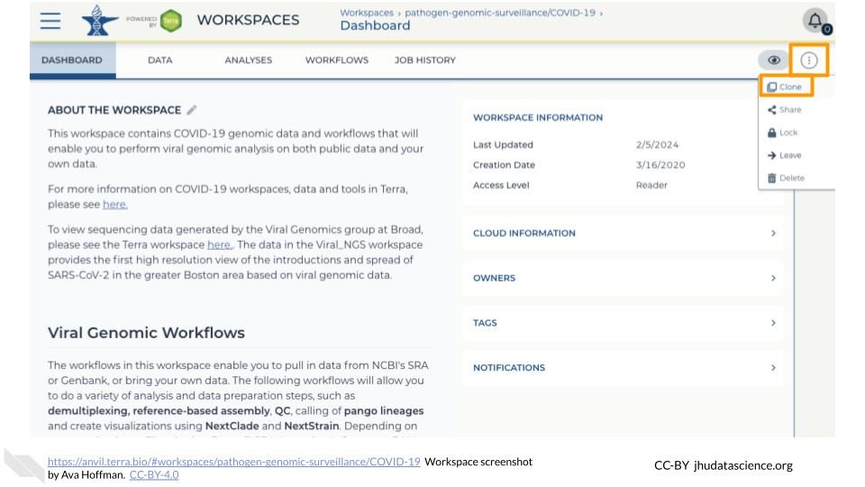
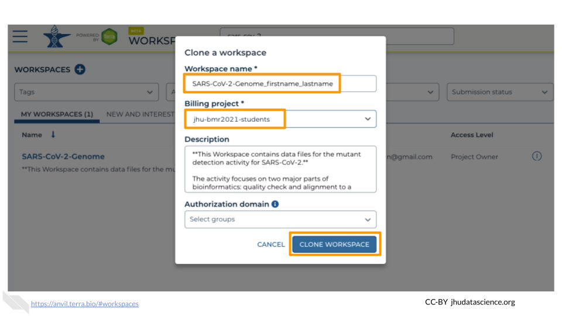

# Setup on AnVIL
In order to access R and RStudio on AnVIL, there are a few steps you need to complete.

 

:::{.notice}
You may be able to skip some of these setup steps if you did them ahead of time.

- If you have already created an AnVIL account, you can start with [Access Materials](#student-clone-workspace)
- If you have already cloned the Workspace, you can start with [Start RStudio](#student-start-RStudio)
:::

## Set up AnVIL Account {#student-setup-anvil-account}

In order to run your analyses, you will use the [AnVIL cloud computing platform](https://anvilproject.org/).  The AnVIL (Analysis Visualization and Informatics Lab-space) platform is specially designed for analyzing biological data, and is used by scientists doing all sorts of biological research.

:::{.notice}
**AnVIL in a nutshell**

- Behind the scenes, AnVIL relies on Google Cloud Platform to provide computing infrastructure.  Basically, AnVIL lets you "rent" computers through the internet. The analysis is run on the rented computer. AnVIL lets you see the results in your browser.
- AnVIL uses [Terra](https://anvil.terra.bio/) to provide many computational tools useful for biological data analysis, such as [RStudio](https://www.rstudio.com/products/rstudio/), [Galaxy](https://usegalaxy.org/), and [Jupyter Notebooks](https://jupyter.org/).  Terra takes care of installing these tools so you can use them right away.
:::

### Create Google Account

First, you will need to set up a (free) Google account.

A Google account usually looks like "`myname@gmail.com`". Alternatively, you can enable Google for an existing non-Gmail email address using [these instructions](https://support.terra.bio/hc/en-us/articles/360029186611).

If you do not already have a Google account that you would like to use for accessing AnVIL, [create one now](https://accounts.google.com/SignUp).

### Log In to Terra

Next, make sure you can log in to Terra -- you will use Terra to perform computations on AnVIL. 

You can access Terra by going to [`anvil.terra.bio`](https://anvil.terra.bio/). Open Terra, and you should be prompted to sign in with your Google account.

### Share Username

Make sure your instructor has your Google account username (e.g. `myname@gmail.com`), so they can give you access to everything you need.

- Make sure there are no typos!
- If you have multiple Google accounts, make sure you give them the username that you will be using to log in to `anvil.terra.bio`.

:::{.warning}
It is *very important* that you share the Google account you will be using to access AnVIL with with your instructor! Otherwise, the instructor cannot add you to Billing Projects or Workspaces, and you will be unable to proceed with your assignments.
:::

## Access Materials (Clone Workspace) {#student-clone-workspace}

:::{.warning}
This **will not work** until your instructor has given you permission to spend money to "rent" the computers that will power your analyses (by adding you to a "Billing Project").
:::

On AnVIL, you access files and computers through **Workspaces**.  Each Workspace functions almost like a mini code laboratory - it is a place where data can be examined, stored, and analyzed. The first thing we want to do is to copy or “clone” a Workspace to create a space for you to experiment.  This will give you access to

- the files you will need (data, code)
- the computing environment you will use

:::{.notice}
**Tip**
At this point, it might make things easier to open up a new window in your browser and split your screen. That way, you can follow along with this guide on one side and execute the steps on the other.
:::

To clone an AnVIL Workspace:

1. Open Terra - use a web browser to go to [`anvil.terra.bio`](https://anvil.terra.bio/)

1. In the drop-down menu on the left, navigate to "Workspaces". Click the triple bar in the top left corner to access the menu. Click "Workspaces".

    

1. You are automatically directed to the "MY WORKSPACES" tab.  Here you can see any Workspaces that have been shared with you, along with your permission level.  Depending on how your instructor has set things up, you may or may not see any Workspaces in this tab.

    
    
1. Locate the Workspace **specified by your instructor**.  (The images below show the SARS-CoV-2-Genome Workspace as an example, but you should look for the Workspace  **specified by your instructor**.)
    a. If it has been shared with you ahead of time, it will appear in "MY WORKSPACES".  

    
    b. Otherwise, select the "PUBLIC" tab.  In the top search bar, type the Workspace name **specified by your instructor**.

    
    c. You can also go directly to the Workspace by clicking this link: ask your instructor.
    
1. Clone the workspace by clicking the teardrop button ({width=25px}). Select "Clone".  Or, if you have opened the Workspace, you can find the teardrop button on the top right of the Workspace.

    
    

1. You will see a popup box appear, asking you to configure your Workspace
    a. Give your Workspace clone a name by adding an underscore ("_") and your name. For example, \"ExampleWorkspace_Firstname_Lastname\".
    a. Select the Billing Project provided by your instructor.
    a. Leave the bottom two boxes as-is.
    a. Click “CLONE WORKSPACE”.
    
    

1. The new Workspace should now show up under "MY WORKSPACES".  You now have your own copy of the Workspace to work in.
