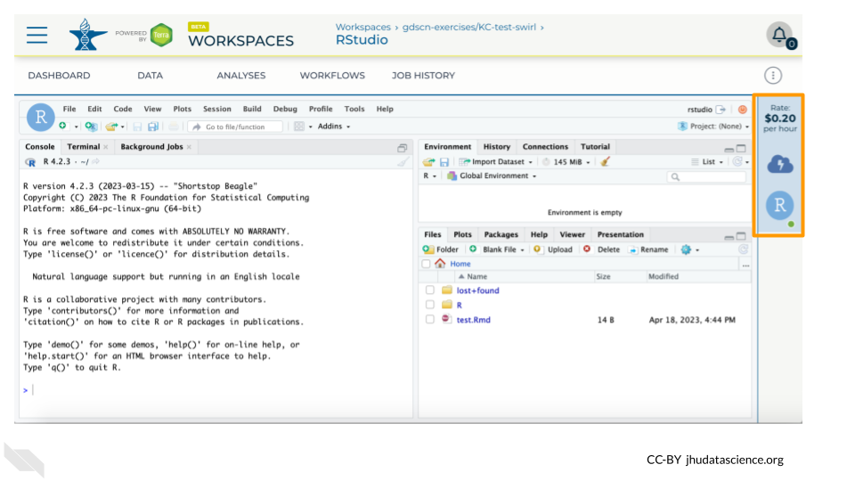

# Wrap-up on AnVIL

Cloud computing costs are based on the amount of time you use the computing resources, so it's important to clean up after yourself when you're done, and not just leave the computers running.

There are two ways to "shut down" RStudio on AnVIL:

- **Pause** the environment: This will save a copy of your work, and then release the computers for other people to use them.  **Do this if you plan to continue working in RStudio**.
    - It's similar to turning off your computer or phone - when you start it back up, everything will be where you left it.
    - This still costs a small amount of money, but much less than leaving the computer running.  
- **Delete** the environment: This will delete everything and then release the computers for other people to use them.  **Do this if you are completely finished working in RStudio**, or if your future work will be in a new environment.
    - It's similar to throwing your computer or phone in the trash!
    - **You will not be able to recover your work.**
    - Make sure you have saved anything you need before you delete your environment.  

## Pause RStudio environment

1. You can view costs and make changes to your cloud environments from the panel on the far right of the page.  If you don’t see this panel, you may need to scroll to the right.  Running environments will have a green dot, and paused environments will have an orange dot.

    

1. Hovering over the RStudio icon will show you the costs associated with your RStudio environment.  Click on the RStudio icon to open the cloud environment settings.

    

1. Click the Pause button to pause RStudio.  This will take a few minutes.

    

1. When the environment is paused, an orange dot will be displayed next to the RStudio icon.  If you hover over the icon, you will see that it is paused, and has a small ongoing cost as long as it is paused.  When you’re ready to resume working, you can do so by clicking the RStudio icon and clicking Resume.

    

1. The right-hand side icon reminds you that you are accruing cloud computing costs. If you don’t see this icon, you may need to scroll to the right.

    

1. You should minimize charges when you are not performing an analysis. You can do this by clicking on the RStudio icon and selecting “Pause”. This will release the CPU and memory resources for other people to use. Note that your work will be saved in the environment and continue to accrue a very small cost.  This work will be lost if the cloud environment gets deleted.  If there is anything you would like to save permanently, it's a good idea to copy it from your compute environment to another location, such as the Workspace bucket, GitHub, or your local machine, depending on your needs.

    

:::{.notice}
You can also pause your cloud environment(s) at https://anvil.terra.bio/#clusters.
:::

## Delete RStudio environment

1. Pausing your cloud environment only temporarily stops your work. When you are ready to delete the cloud environment, click on the RStudio icon on the right-hand side and select “Settings”.  If you don’t see this icon, you may need to scroll to the right.

    

1. Click on “Delete Environment”.

    

1. If you are certain that you do not need the data and configuration on your disk, you should select "Delete everything, including persistent disk".  If there is anything you would like to save, open the compute environment and copy the file(s) from your compute environment to another location, such as the Workspace bucket, GitHub, or your local machine, depending on your needs.

    

1. Select "DELETE".

    

:::{.notice}
You can also delete your cloud environment(s) and disk storage at https://anvil.terra.bio/#clusters.
:::
