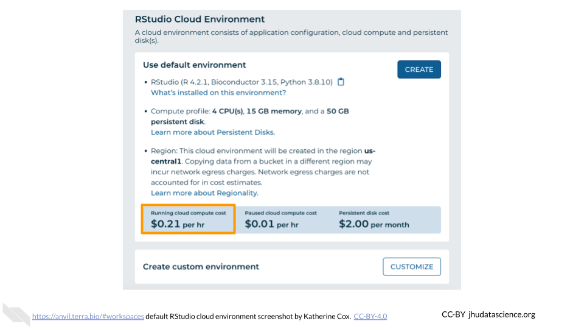
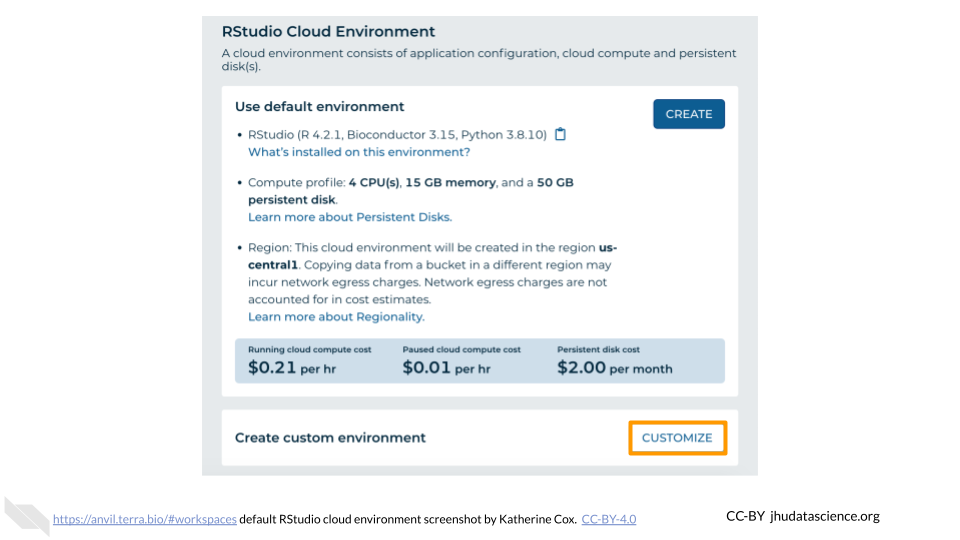
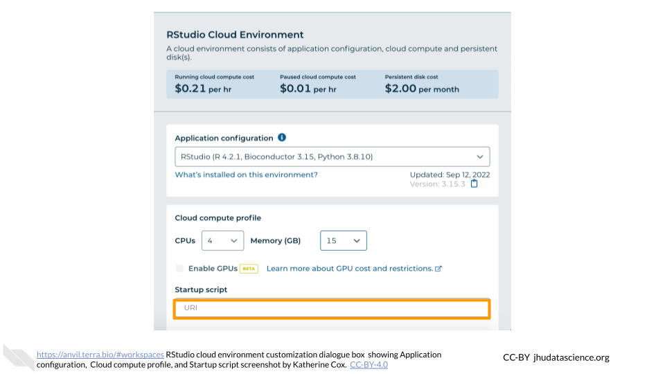
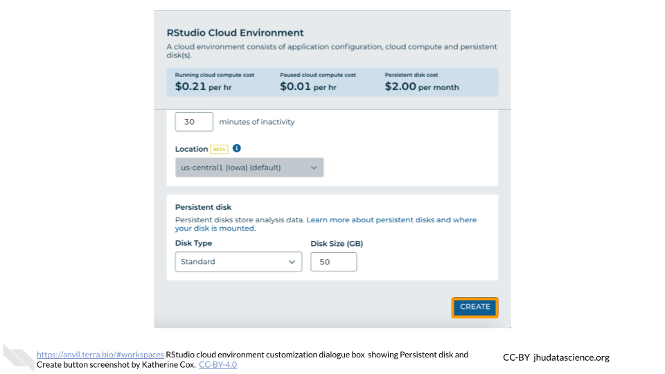

:::{.warning}
**Pause here** if you are not going to be doing the lab exercises right away.  Once you start up RStudio, it will cost money to keep it running.  It costs a few cents an hour, so it's quite cheap as long as you use it responsibly.  But it can add up if you leave it running for days or weeks when you don't need it.
:::

## Start RStudio {#student-start-RStudio}

:::{.warning}
AnVIL is very versatile and can scale up to use very powerful cloud computers. It's very important that you select the cloud computing environment described here to avoid runaway costs.
:::

1. Open Terra - use a web browser to go to [`anvil.terra.bio`](https://anvil.terra.bio/)

1. In the drop-down menu on the left, navigate to "Workspaces". Click the triple bar in the top left corner to access the menu. Click "Workspaces".

    

1. Click on the name of your Workspace. You should be routed to a link that looks like: `https://anvil.terra.bio/#workspaces/<billing-project>/<workspace-name>`.

1. Click on the cloud icon on the far right to access your Cloud Environment options.

    

1. In the dialogue box, click the "Settings" button under RStudio

    

1. You will see some details about the default RStudio cloud environment, and a list of costs because it costs a small amount of money to use cloud computing.

    

    

1. Click "CUSTOMIZE" to adjust the settings for your environment.

    

    

    

1. Under "Startup script" you will see textbox.  Copy the following link into the box:

    ` ask your instructor `

    

1. Leave everything else as-is. To create your RStudio Cloud Environment, click on the “CREATE” button.

    

1. The dialogue box will close and you will be returned to your Workspace.  You can see the status of your cloud environment by hovering over the RStudio logo.  It will take a few minutes for Terra to request computers and install software.

    

1. When your environment is ready, its status will change to “Running”.  Click on the RStudio logo to open a new dialogue box that will let you launch RStudio.

    
    
1. Click the launch icon to open RStudio.  This is also where you can pause, modify, or delete your environment when needed.

    

1. You should now see the RStudio interface with information about the version printed to the console.

    
